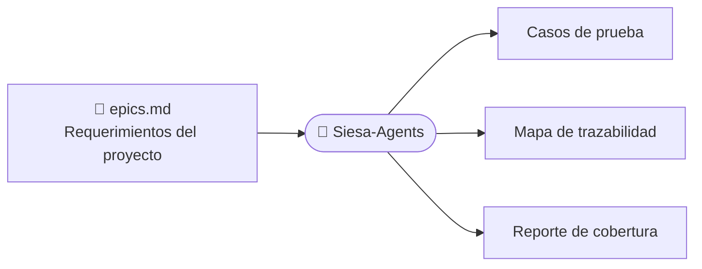
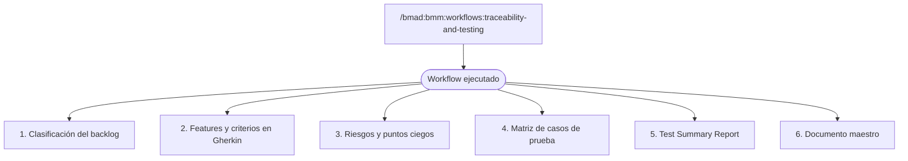
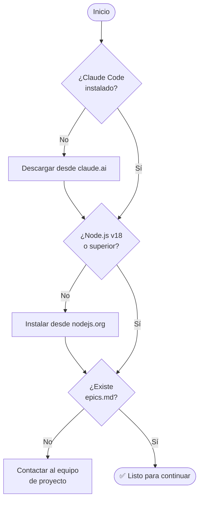
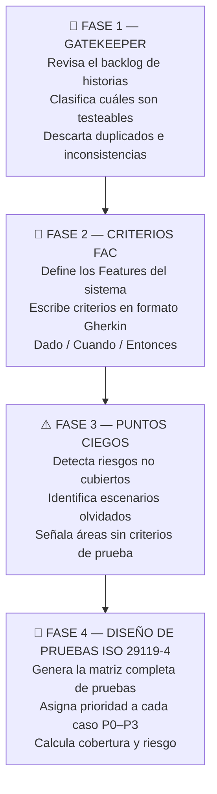

# Siesa-Agents: Traceability & Testing
### Guía de capacitación — De la instalación a los resultados

> **Para quién es esta guía:** Testers y QA funcionales que nunca han usado Siesa-Agents y necesitan ejecutar el workflow de trazabilidad y diseño de pruebas.

---

---
## SLIDE 1 — ¿Qué es Siesa-Agents?

> **Mensaje clave:** Una herramienta de IA que automatiza el análisis y generación de pruebas a partir de los requerimientos del proyecto.

### En una frase
Siesa-Agents es un asistente de inteligencia artificial instalado en tu proyecto que entiende los requerimientos funcionales y genera casos de prueba, mapas de trazabilidad y reportes de cobertura de forma automática.

### Lo que NO tienes que hacer
- ❌ Escribir casos de prueba manualmente
- ❌ Cruzar épicas con requerimientos a mano
- ❌ Construir matrices de trazabilidad en Excel desde cero

### Lo que SÍ hace por ti
- ✅ Lee las épicas e historias del proyecto
- ✅ Detecta qué falta cubrir con pruebas
- ✅ Genera documentos listos para revisar con el equipo



---

---
## SLIDE 2 — ¿Qué produce el workflow?

> **Mensaje clave:** Con un solo comando obtienes 6 documentos estructurados que cubren todo el ciclo de diseño de pruebas.



Todos los documentos quedan guardados automáticamente en una carpeta con fecha y hora.

---

---
## SLIDE 3 — Lo que necesitas antes de empezar

> **Mensaje clave:** Solo necesitas 3 cosas. Si alguna falta, contacta al equipo antes de continuar.

### Checklist de prerrequisitos

| # | Qué necesitas | Dónde está | ¿Obligatorio? |
|---|---------------|-----------|---------------|
| 1 | **Claude Code** instalado en tu computador | Descarga desde claude.ai | ✅ Sí |
| 2 | **Node.js v18 o superior** | nodejs.org | ✅ Sí |
| 3 | **`epics.md`** — el archivo con las épicas del proyecto | `_bmad-output/planning-artifacts/epics.md` | ✅ Sí |

### ¿Tengo todo lo necesario?



### Cómo verificar Node.js
Abre una terminal y escribe:
```
node --version
```
Si aparece un número como `v18.x.x` o mayor, estás listo.

---

---
## SLIDE 4 — Instalación

> **Mensaje clave:** La instalación se hace una sola vez desde la carpeta raíz del proyecto.

Abre una terminal en la carpeta raíz de tu proyecto y ejecuta:

```bash
npx siesa-agents
```

Esto instala y crea la carpeta `_bmad/` con todos los agentes y workflows. ✅

---

---
## SLIDE 5 — Verifica que tienes las épicas

> **Mensaje clave:** Sin el archivo `epics.md` el workflow no puede ejecutarse. Verifica su contenido antes de continuar.

### ¿Dónde está?
```
_bmad-output/
  └── planning-artifacts/
        └── epics.md    ← ESTE ARCHIVO
```

### ¿Qué debe tener adentro?

- [ ] Requerimientos funcionales con IDs: `FR-001`, `FR-002`…
- [ ] Épicas organizadas con sus historias dentro
- [ ] Una sección llamada **FR Coverage Map**
- [ ] **Criterios de aceptación** en cada historia

### Si el archivo no existe o está incompleto
Contacta al equipo de proyecto antes de continuar. Este archivo es producido por quienes trabajaron la planificación del sistema — no es algo que tú generas.

---

---
## SLIDE 6 — Ejecutar el workflow

> **Mensaje clave:** Un solo comando. El agente hace el resto.

### El comando principal

Desde el chat de Claude Code, escribe:

```
/bmad:bmm:workflows:traceability-and-testing
```

El agente se encarga del resto automáticamente.

---

---
## SLIDE 7 — Qué hace el workflow por dentro (4 fases)

> **Mensaje clave:** El workflow aplica una metodología de 4 fases basada en el estándar ISO 29119. Tú no tienes que hacer nada mientras trabaja.



---

---
## SLIDE 8 — Los 6 documentos que obtienes

> **Mensaje clave:** Cada documento tiene un propósito específico. El documento maestro contiene todo en un solo lugar.

```
📁 traceability-artifacts/test-design-2026-02-23-143052/
│
├── 📄 test-design-complete.md
│       → Documento maestro — todo el contenido unificado
│
├── 📄 test-design-phase1-gatekeeper.md
│       → Clasificación del backlog
│         (qué historias se pueden testear y cuáles no)
│
├── 📄 test-design-phase2-fac.md
│       → Features con criterios en formato Gherkin
│
├── 📄 test-design-phase3-blind-spots.md
│       → Riesgos detectados y áreas sin cobertura
│
├── 📄 test-design-phase4-test-matrix.md
│       → Todos los casos de prueba con prioridad y pasos
│
└── 📄 test-design-phase5-tsr.md
        → Test Summary Report + mapa de trazabilidad completo
```

### Métricas que verás al finalizar

| Métrica | Descripción |
|---------|-------------|
| Features identificados | Cuántas funcionalidades distintas se encontraron |
| Casos de prueba totales | Total de casos generados |
| Casos P0 (Críticos) | Casos que no pueden fallar en producción |
| Cobertura de riesgos | % de riesgos cubiertos por al menos un caso |

---

---
## SLIDE 9 — Tarjeta de referencia rápida

> Imprime esta tarjeta y tenla a mano durante la ejecución.

```
┌──────────────────────────────────────────────────────┐
│          SIESA-AGENTS — TRACEABILITY & TESTING        │
│                   REFERENCIA RÁPIDA                   │
├──────────────────────────────────────────────────────┤
│                                                      │
│  INSTALAR (una sola vez)                             │
│  ─────────────────────                               │
│  npx siesa-agents                                    │
│                                                      │
│  VERIFICAR ANTES DE EJECUTAR                         │
│  ───────────────────────────                         │
│  ✅ _bmad-output/planning-artifacts/epics.md existe  │
│                                                      │
│  EJECUTAR                                            │
│  ────────                                            │
│  /bmad:bmm:workflows:traceability-and-testing        │
│                                                      │
│  RESULTADOS                                          │
│  ─────────                                           │
│  _bmad-output/implementation-artifacts/              │
│    traceability-artifacts/test-design-FECHA/         │
│                                                      │
└──────────────────────────────────────────────────────┘
```

---

*Siesa-Agents v6.0.0-alpha.22 — Workflow: traceability-and-testing*
*Capacitación para testers y QA funcionales*
